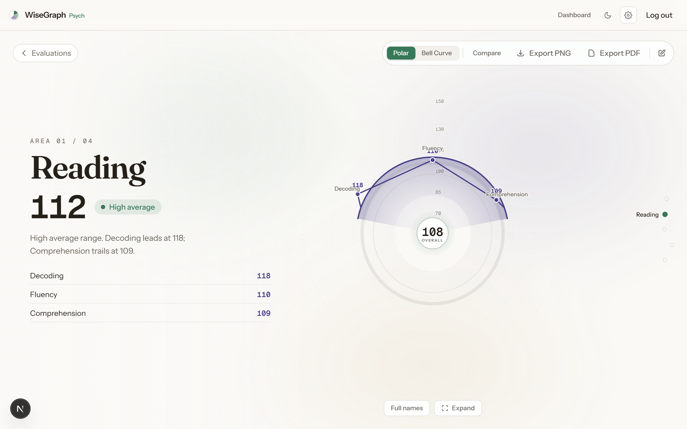
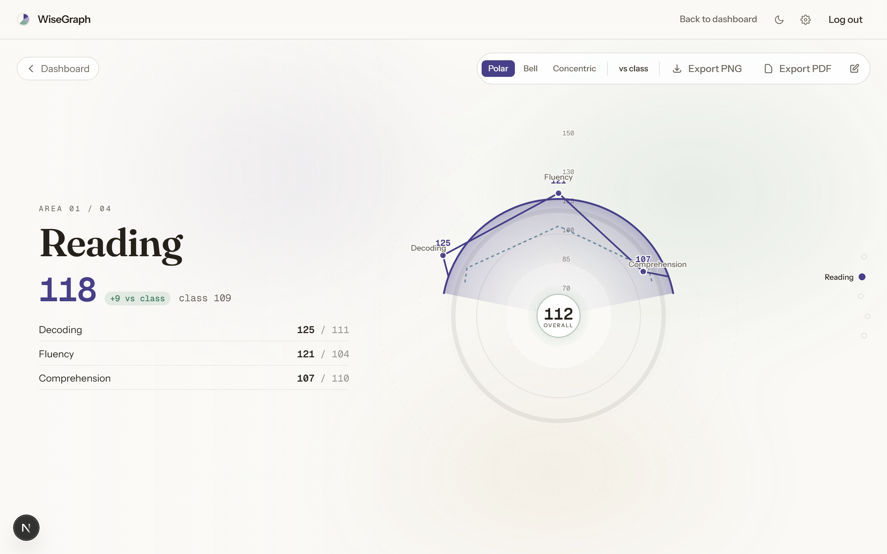
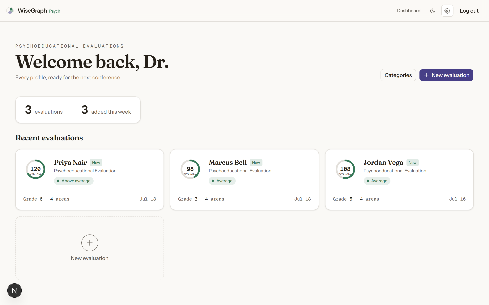

# WiseGraph

WiseGraph turns standardized test scores into charts a teacher or school psychologist can read at a glance and share with a parent in a conference.

Live at [wisegraph.vercel.app](https://wisegraph.vercel.app).

## Two modes

WiseGraph fits two roles, each with its own view.

**Psychologist.** Build an evaluation for a student, score each assessment area and its subtests, and read the results on one radial chart or a bell curve. As you scroll, each area opens up to show the subtests underneath it and where they fall.

**Teacher.** Track a whole class, then open any student to see their profile drawn against the class average, so you can tell who is ahead and who needs a closer look.

## What the numbers mean

Scores use the standard-score scale that assessment kits report. 100 is exactly average, and every 15 points is one standard deviation. WiseGraph shows the range from 60 to 150 and shades the average band of 85 to 115 on every chart, so a score reads as a spot on the normal distribution instead of a raw percentage. A 130 is not "130 percent." It means the student scored higher than about 98 out of 100 peers their age.

## What you can do

- See every area on one radial chart, or switch to a bell curve.
- Open a domain to read its subtests, percentile, and classification band.
- Compare a student to a saved snapshot from last year, or to the class average.
- Export any chart as a PNG or PDF, clean enough to project or hand across a table.
- Work in light or dark on the same readable layout throughout.

## Who it's for

WiseGraph was built for a student support specialist who gives these assessments and then has to explain them to families. It suits anyone who works with standardized scores and needs to make them clear to someone who has never seen one.

Built with Next.js, Prisma, and Supabase.
